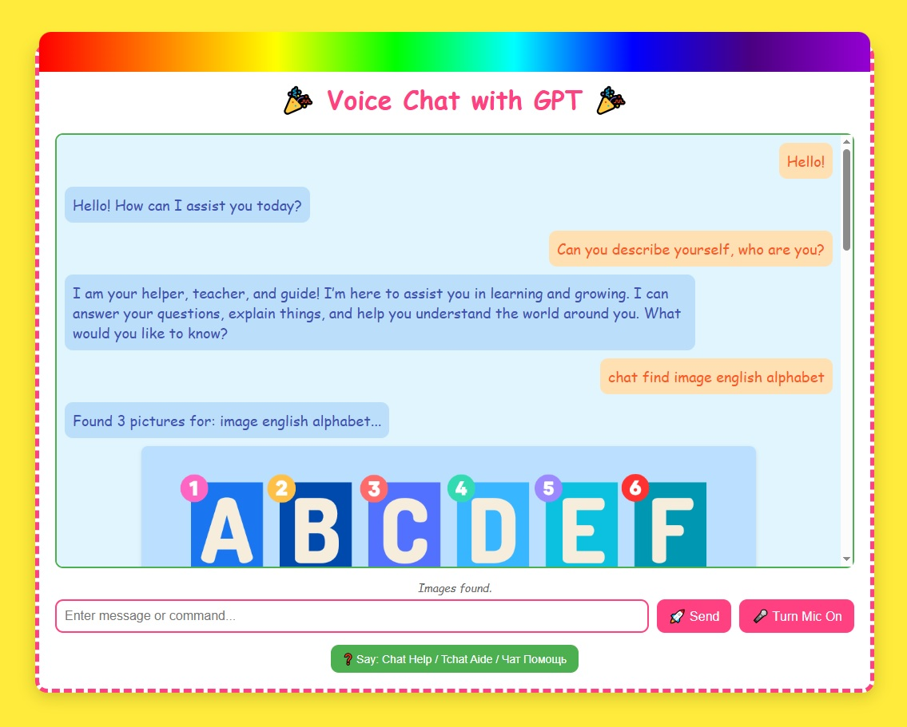

<p align="center">

</p>
 
 ## Multilingual AI Voice Chat Assistant for Kids from (Gemini-2.5-pro)

This project is a web-based chat application built with Flask that allows users to interact with an AIassistant (OpenAI GPT-4o-mini) via text or voice in multiple languages (Russian, English, French). Itfeatures real-time speech recognition, image generation, image search, video search with content filtering,and audio responses.

## Features

- **Multilingual Interaction:** Supports text and voice input/output in Russian, English, and French.
- **Real-time Voice Input:** Utilizes the Web Speech API for voice transcription directly in the browser.
- **Voice Commands:** Activate/deactivate voice input and switch recognition language using voicecommands.
- **Text Commands:** Use text commands with prefixes (`chat`, `tchat`, `чат`) for specific actions.
- **AI Integration:** Leverages OpenAI's GPT-4o-mini for generating conversational responses.
- **Image Generation:** Generate images based on user prompts using the Stability AI (SDXL) API.
- **Image Search:** Find images using the Google Custom Search API with language filtering (`lr=lang_rulang_en|lang_fr`).
- **Video Search:** Find YouTube videos using the YouTube Data API v3.
- **Content Filtering:**
  - Uses `safeSearch=strict` for YouTube and Google Image searches.
  - Filters YouTube video results based on title language (only Russian, English, French allowed).
  - Filters YouTube video results using a blacklist of keywords/stems in titles to remove potentiallyinappropriate content (religion, violence, adult themes, etc.).
- **Audio Responses:** Generates spoken responses using Google Text-to-Speech (gTTS) in the detectedlanguage of the AI's answer.
- **Dynamic Media Display:** Shows generated/found images and YouTube video embeds directly in the chatinterface.
- **Help Menu:** Provides a modal window explaining available commands.
- **Resource Management:** Includes basic cleanup for old audio files and limits conversation historylength.

## Technologies Used

- **Backend:** Python, Flask
- **Frontend:** HTML, CSS, JavaScript
- **AI & APIs:**
  - OpenAI API (GPT-4o-mini)
  - Stability AI API (Stable Diffusion XL)
  - Google Custom Search API
  - YouTube Data API v3
  - Web Speech API (Browser-based)
  - Google Text-to-Speech (gTTS library)
- **Libraries:** `requests`, `python-dotenv`, `Flask-Cors`, `gTTS`
- **Environment Management:** `venv` (recommended)

## Setup Instructions

1.  **Clone the repository:**
    ```bash
    git clone https://github.com/ALexX-SH/EducationGPT.git
    cd EducationGPT
    ```
2.  **Create and activate a virtual environment:**
    - On macOS/Linux:
      ```bash
      python3 -m venv venv
      source venv/bin/activate
      ```
    - On Windows:
      ```bash
      python -m venv venv
      .\venv\Scripts\activate
      ```
3.  **Install dependencies:**
    ```bash
    pip install -r requirements.txt
    ```
4.  **Set up environment variables:**
    - Create a file named `.env` in the project root directory.
    - Copy the contents of `.env.example` into `.env`.
    - Fill in your actual API keys in the `.env` file. Get your keys from:
      - OpenAI: [https://platform.openai.com/api-keys](https://platform.openai.com/api-keys)
      - Stability AI: [https://platform.stability.ai/account/keys](https://platform.stability.ai/account/keys)
      - Google Custom Search API & YouTube Data API v3: [https://console.cloud.google.com/](https://console.cloud.google.com/) (You'll need to enable these APIs and create credentials).
      - For `GOOGLE_URL`, create a Custom Search Engine at [https://programmablesearchengine.google.com/](https://programmablesearchengine.google.com/) targeting the whole web, get the public URL, and extract the `cx` parameter value for `GOOGLE_CSE_ID` (this is done automatically in `app.py` if you provide the full URL in `.env`).
    - **IMPORTANT:** Do NOT commit your `.env` file to Git. The `.gitignore` file should prevent this.

## Running the Application

1.  Make sure your virtual environment is activated.
2.  Run the Flask development server:
    ```bash
    flask run
    ```
    or
    ```bash
    python app.py
    ```
3.  Open your web browser and navigate to `http://127.0.0.1:5000` (or the address provided by Flask).

## Configuration

    All necessary API keys and the Google Custom Search Engine URL must be configured in the `.env` file as shown in `.env.example`. The application will log warnings if keys are missing but might still run with limited functionality.

## How to Build `.exe` Using PyInstaller

1. Install PyInstaller:

   pip install pyinstaller

2. Build the executable:

   pyinstaller --noconfirm --onefile --add-data "static;static" --add-data "templates;templates" app.py

Explanation:

- `--noconfirm`: overwrite any previous build
- `--onefile`: bundle everything into one `.exe`
- `--add-data`: include folders (use `;` as separator on Windows, `:` on Linux/macOS)

**Important for Windows builds**:  
After building, static files will be extracted to a temp folder (e.g., `C:\\Temp\\_MEIxxxxx`). Use relative paths like `static/audio` to avoid file not found issues.

## Project Structure
    
project/
├── app.py  
├── templates/  
│   └── chat.html  
├── static/  
│   ├── audio/  
│   └── images/  
├── requirements.txt  
└── README.md